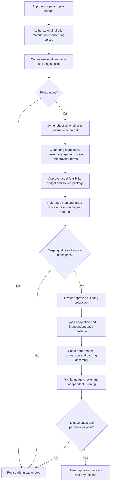

# Production plan

Research date: **2026-09-20**. Status: **planning complete; production not approved or started**. All proposed work below is future work. The project owner retains production approval and spending authority. Primary sources and their limitations are recorded in [SOURCES.md](SOURCES.md); numbered source links below resolve there.

**Recommended route:** expert-reviewed Klingon adaptation -> coached human singing guide -> explicitly authorized singing-voice conversion -> licensed official backing from the chosen Cash version, if obtainable -> mix and independent listening review.

**Uncertainty:** Cash-identical vocal character, Klingon diction after conversion, and suitable licensed source assets are unverified. Do not promise an indistinguishable result.

**Stages:** approve a bounded original-material pilot; resolve target permissions and sources; audition the target voice; approve full-song work only if those gates pass. No production stage is authorized by this plan.

**Go/no-go:** correct meaning and pronunciation, fixed musical timing, expressive resemblance, clean backing, complete permissions, and owner approval. The [roadmap](#2-dependency-ordered-roadmap) and [acceptance criteria](#8-measurable-gono-go-checks) make these decisions measurable.

## 1. Scope and feasibility

The target is a Klingon-language adaptation of **Hurt as performed by Johnny Cash**, with the specific reference version's instrumental performance, arrangement, melody, timing, emotional trajectory, and vocal character preserved as closely as possible. This is an audio project; video, artwork, distribution campaigns, and an interactive application are outside scope.

Proposed reference, awaiting owner confirmation: the album recording on *American IV: The Man Comes Around*, released November 5, 2002. The official Cash site separately identifies a March 2003 single/video release and credits **Trent Reznor** as songwriter. Do not assume album, video, compilation, and remastered releases use interchangeable audio. Before production, identify the exact edition and authorized file, duration, sample rate, channel layout, and checksum. No recording was obtained or analyzed for this plan. [S01](SOURCES.md#s01)

**Verdict: conditionally plausible as an authorized reinterpretation; an indistinguishable Cash performance with only the language changed is not established.** The best candidate is an expert-coached human singing reference, converted through an explicitly authorized singing-voice model, mixed with licensed official backing if obtainable. Literal acoustic identity cannot survive changing phonemes. Musical timing and perceived character are meaningful targets, but there may be no Klingon wording that simultaneously preserves every semantic nuance, syllable placement, and expressive gesture.

Planning confidence is high that an expert-led Klingon performance can be attempted with conventional recording and editing. Confidence in Cash-identical Klingon output is low: there is no project audio, rights confirmation, suitable model evaluation, or Klingon singing benchmark here. Numerical success probabilities would be invented; update confidence after the controlled pilot and a separately cleared target-voice evaluation.

| Highest-risk assumption | What is known | Evidence required before commitment |
| --- | --- | --- |
| The necessary parties will authorize adaptation, recording use, and voice identity | These are distinct permission questions | Written grants covering the actual project, source material, processors, and release |
| Suitable backing and Cash voice material can be licensed | Availability has not been verified | Source inventory, permission scope, delivery quality, and provider acceptance |
| A model can retain Cash's mature vocal character in Klingon | Singing conversion exists; this specific result is unverified | Approved target-voice audition passing language and musical review |
| Klingon fits the fixed melody naturally | Singable translation has constraints beyond literal meaning | Expert adaptation, independent back-translation, and timed singing review |
| Conversion preserves consonants and vulnerability | Timbre resemblance alone cannot establish either | Blind comprehension, artifact, and emotional-delivery checks |

Current deliverables are documents only. No lyrics have been generated or translated; no recordings downloaded, stems separated, voices trained, models acquired, service purchases made, contact messages sent, or audio produced. The public repository must continue to exclude copyrighted lyrics and their translations, audio, model weights, credentials, private examples, contracts, and operational details.

## 2. Dependency-ordered roadmap

Every production node below requires separate owner approval. Passing a gate permits a proposed next step only within its approved budget and permissions.

| Phase | Depends on | Deliverable and stopping gate |
| --- | --- | --- |
| 0. Scope | This plan | Confirm edition, fidelity definition, private/public use, territory, contributors, and pilot cap; no default production authorization |
| 1. Original-material pilot | Approved pilot and complete rights to pilot inputs | 20-30 seconds plus a short spoken diagnostic; stop if consonants, singing, or expression fail within two revision rounds |
| 2. Target clearance | Owner elects to continue | Verified rights/source package and compatible provider agreement; no Cash uploads, translation, extraction, or model work before the relevant grants |
| 3. Target feasibility | Cleared source package and separate phase budget | Version map, backing audition, and authorized target-voice test on original material; inability to obtain suitable stems/voice assets can end the strict route |
| 4. Adaptation | Owner approves full-song work | Literal draft, sung adaptation, back-translation, phoneme/prosody map, and documented approvals |
| 5. Performance and conversion | Approved adaptation and target audition | Human guide, converted vocal, dry comparison, approved backing; repair or re-record phrases instead of repeatedly damaging them with processing |
| 6. Mix and review | Approved performance assets | Candidate lossless mix, language review, musical review, and controlled listening report |
| 7. Delivery/release | All gates plus owner and required rightsholder sign-off | Master, listening copy, provenance/credits/disclosure; distribution is a separate explicit decision |

Rights investigation may begin alongside the original pilot if separately authorized. No outreach has been sent. Failure to secure the strict route's permissions is a valid outcome, not a reason to quietly change the performer or backing.

## 3. Klingon language and musical adaptation

Use Marc Okrand's standard romanized orthography for production text. Preserve case exactly; `q` and `Q` differ, `'` represents a glottal stop, and sequences such as `ng` and `tlh` are letters rather than English letter-by-letter spellings. Do not apply automatic sentence capitalization or discard apostrophes. The KLI sound guide describes retroflex `D`, uvular `q`, `Q`, `H`/`gh`, and the lateral articulation of `tlh`. These are specific pronunciation targets, not a generic growling accent. [S06](SOURCES.md#s06), [S07](SOURCES.md#s07)

Recruit a lead Klingon translator with demonstrated oral fluency and performance experience, plus an independent reviewer. Advanced KLI credentials are useful evidence of written competence, but KLI certification uses written tests; it does not by itself certify sung pronunciation. Use fluent/expert listeners, or native speakers if actually available, without assuming a native-speaker pool exists. [S08](SOURCES.md#s08)

Literal translation and singable adaptation are separate deliverables. A literal version protects meaning for review; the sung version must fit existing notes, syllable opportunities, and phrase durations. Song-translation research explicitly distinguishes these purposes and constraints. [S09](SOURCES.md#s09)

Proposed method, only after adaptation permission:

1. Establish a private semantic brief for each phrase: viewpoint, referents, tense/aspect, imagery, emotional intensity, and ambiguity. Do not reproduce song text in public planning or issue discussions.
2. Prepare the literal Klingon draft and an independent English back-translation. Record uncertain vocabulary and interpretations; ask the expert to verify current attested usage.
3. Develop a sung adaptation against the fixed musical phrase map. Prioritize meaning, grammatical naturalness, intelligibility, and melodic fit. Preserve rhyme where it helps; do not force it at the cost of comprehension. Any material semantic compromise needs owner and rightsholder approval as applicable.
4. Annotate syllable boundaries, phonemes/IPA, lexical and phrase stress, consonant preparation, vowel nucleus, sustain, release, breath, and available rest. Let a Klingon expert decide permissible pronunciation variation in singing rather than importing English stress rules.
5. Rehearse at performance speed. Sustain appropriate vowel portions and place consonant attacks/releases around note anchors without erasing phonemic contrasts. Do not time-stretch a difficult consonant until it becomes a different sound.
6. Review spoken, dry sung, converted, and mixed versions separately. Use blind transcription/comprehension before showing listeners the intended text. Independent back-translation checks semantic drift; it does not prove the sung version is intelligible.

Human review is the alignment reference. An English forced aligner or recognizer is not a validated Klingon evaluator. Automated pitch/onset analysis may assist the engineer, with manual correction of low-register, creaky, breathy, and unvoiced regions.

## 4. Preserve the chosen performance

After the source package is authorized, the engineer and producer should create a version-specific reference map, not a generic tempo/key description taken from the web.

| Element | Preservation method | Limit or conflict to resolve |
| --- | --- | --- |
| Timing and structure | Map actual phrase entrances, rests, breath windows, section boundaries, rubato, and ending; lock the session to reference time | No global quantization or automatic constant-tempo replacement |
| Melody | Record phrase-level notes, pitch contours, scoops, sustains, releases, and optional deviations; manually audit pitch tracking | Klingon may require different syllable allocation; retain notes unless a deviation is explicitly approved |
| Arrangement and backing | Prefer licensed official instrumental mix or session stems from the exact version, aligned to common start | Availability is unknown; alternate mixes may omit shared effects or mastering interactions |
| Emotional delivery | Coach restraint, breath use, tension, phrase-end decay, dynamic growth, and intentional irregularity against a producer-approved map | Conversion transfers some features and changes others; a timbre match alone can sound emotionally wrong |
| Vocal character | Use authorized source material representative of the desired era, register, texture, and recording conditions; compare against permissioned references | A generic low male voice or another era of Cash is not the same target; archive coverage may be insufficient |
| Mix space | Match vocal level, stereo placement, room/reverb, equalization, dynamic envelope, and transitions through controlled listening | Replacing the vocal changes interaction with shared compression and reverb; even genuine stems may not exactly reconstruct the released master |

The practical route is to record a dry, expert-approved Klingon guide sung to the reference map, then convert that guide's singing voice using the authorized target model. The guide supplies language, melody, timing, and much of the expression. Conversion changes vocal identity; it does not translate the original English recording. Preserve takes and compare before/after conversion for lost consonants, altered breath, unstable pitch, or smoothed-away fragility.

Official licensed stems, **if available**, are preferable to extraction because they may retain original instrument detail without requiring a separator to infer it. Check them for vocal spill and shared effects too. Extraction from a stereo master can retain intelligible English words or reverb, remove instrument energy overlapping the vocal, and create watery transients, phasing, or pumping. Separation is not a reversible subtraction of a perfectly known vocal; iZotope explicitly documents bleed versus artifact compromises. [S18](SOURCES.md#s18)

If only extraction is licensed, test sparse passages, dense passages, and exposed tails before accepting the backing. If it fails, stop and ask the owner whether to relax the target. Newly recorded backing is an alternative performance even when the notes and instrumentation match.

## 5. Candidate tools and routes

Evidence below establishes documented product categories and restrictions, not measured performance on this project. No reviewed source verifies a licensed Cash singing model that handles Klingon. A claim of multilingual speech or "any language" conversion would not establish correct Klingon singing.

| Candidate | Verified capability and language evidence | Permission/licensing considerations | Assessment |
| --- | --- | --- | --- |
| Human guide + Kits AI singing conversion | Audio upload/recording and singing voice conversion are documented. Reviewed pages do not establish a validated Klingon singing language inventory. [S10](SOURCES.md#s10) | Terms prohibit unauthorized impersonation and require source rights. They also address provider ownership of custom models and reuse of uploads for training, with a prospective opt-out process. [S11](SOURCES.md#s11) | Practical pilot candidate with a consenting singer. For Cash, require written acceptance of estate authority, archive licenses, and data handling before uploading anything. |
| Human guide + Voice-Swap Singing Studio/custom model | Singing Studio and custom voice services are explicitly distinguished from its speech product. Klingon accuracy remains unverified. [S13](SOURCES.md#s13) | Terms and prohibited-use policy require rights to inputs, voice identity, models, and output. Asset/model-specific commercial conditions still need confirmation. General training beyond the requested service requires informed consent under the reviewed terms. [S14](SOURCES.md#s14) | Second provider to evaluate after permissions. No inference that Cash participates in its roster or that an artist subscription grants song rights. |
| Synthesizer V Studio 2 Pro + licensed voice | Singing synthesis with note, pitch, and phoneme timing controls; documented languages are English, Spanish, Japanese, Korean, Mandarin, and Cantonese. Klingon is not listed. [S15](SOURCES.md#s15) | Official voices are described as licensed from consenting performers; check the chosen voice's actual use conditions. That is not a Cash license. | Useful for controlled musical sketches. Approximating Klingon through other phoneme inventories is experimental and may lose contrasts. A stock voice relaxes the vocal-identity target. |
| Eleven Music | Actual music generation with multilingual vocals, including English, Spanish, German, and Japanese; reviewed documentation does not verify Klingon. [S16](SOURCES.md#s16) | General Music Terms restrict artist/song identifiers as inputs and misleading impersonation; model-specific terms take precedence where they conflict. Commercial-use language does not grant this song's adaptation/master/voice rights. [S17](SOURCES.md#s17) | Poor fit for the strict target: no demonstrated guarantee of unchanged backing, exact phrasing, or Cash character. Do not substitute speech TTS, dubbing, or iconic speech voices as proof of singing capability. |
| DAW editing and optional RX Music Rebalance | Conventional manual timing/mix work; RX documents source separation and its bleed/artifact tradeoff. No Klingon language requirement for waveform editing. [S18](SOURCES.md#s18) | Software permission does not authorize processing a third-party recording. | Engineering support after source clearance, not a source of voice or song rights. |

**Selection recommendation:** pilot human guide + singing conversion with a consenting living performer, comparing at most two permission-compatible providers. Select on measured diction and expression, source rights, retention/training terms, and deliverable quality. Do not choose a vendor solely for a celebrity-style demo or speech quality. If standard terms conflict with the licensed archive's restrictions, obtain an acceptable agreement or stop that route.

A September 10, 2026 UMG announcement describes a separate ElevenLabs fan-music platform in development for participating artists. It does not identify this song, Cash voice authorization, Klingon support, or a launch-ready solution. Recheck as a future option, not as clearance or a current dependency. [S19](SOURCES.md#s19)

## 6. Small proof of concept

Use **newly written or user-supplied authorized text and music**, with permission for translation, recording, conversion, and the selected provider's processing. Use a consenting singer's own voice/model or an appropriately licensed library voice. Do not use excerpts, melody, backing, lyrics, or unauthorized voice assets from *Hurt*. Write nothing for this pilot until it is approved.

The future 20-30 second test should cover low sustained notes, quiet and stronger delivery, breaths, phrase endings, and expert-selected consonant contrasts. Record a spoken diagnostic and two sung takes. Keep the human guide as the baseline and compare conversion at two conservative settings or providers. Include a brief known-clean, newly recorded backing to test masking; retain isolated tracks for diagnosis.

Two independent Klingon experts should transcribe and explain what they hear without the script, then compare against the approved pilot text. A producer should assess phrase timing, pitch, emotion, and artifacts against the guide. Report counts and disagreements, not just an average rating. Evaluate on headphones, speakers, and mono.

This pilot can falsify language and conversion assumptions cheaply. It cannot validate Cash resemblance, licensed stem availability, song clearance, or whole-song consistency. Those require the separate target feasibility phase, using authorized Cash assets only when permitted. Recommended first authorization request: **up to $2,500 total, no more than 20 working hours, two revision rounds, no automatic renewal or full-song commitment**. If qualified contributors cannot fit that cap, bring back quotes rather than reduce review silently.

## 7. Proposed input and output specifications

These are proposed production specifications, not descriptions of files currently held.

| Item | Specification |
| --- | --- |
| Reference | Exact owner-approved version; lawfully supplied lossless source with provenance, checksum, original format, duration, and use permissions |
| Backing | Prefer original-resolution WAV/BWF or lossless equivalent, common start and full tails; document whether official mix, official stems, extraction, or new recording |
| Human guide | Dry mono WAV, preferably 24-bit/48 kHz, no clipping, clear pronunciation and low room noise; retain unprocessed takes and musical/phonetic annotations |
| Model material | Only provider-accepted, permissioned assets; amount/format determined from vendor requirements after provider selection, not a guessed minimum archive size |
| Session | Common clock and zero point; document source sample rates, resampling, model/version, settings, edits, and approvals privately |
| Lossless master | Stereo PCM WAV, 24-bit at the agreed session rate: normally 48 kHz for new recording, or 44.1 kHz when keeping a 44.1 kHz source workflow; full ending and no clipped samples |
| Listening copy | Stereo MP3 at 320 kb/s, encoded once from the lossless master; check codec-induced peak overs and audible artifacts |
| Supporting delivery | Dry vocal and backing stems if licenses permit; private adaptation/review notes, source manifest, quality report, and approved credits/disclosure |

Keep original-resolution assets. Upsampling or exporting lossy vendor output as WAV does not restore lossless provenance. If a provider only supplies compressed or unsuitable-resolution output, disclose that limitation and obtain acceptance or choose another provider before scaling up.

Proposed master true-peak ceiling is -1 dBTP, subject to destination requirements. Preserve dynamics rather than applying a blanket loudness target. Compare references at matched loudness and report integrated loudness, loudness range, and true peak; select any distribution-specific targets only after the destination is chosen.

## 8. Measurable go/no-go checks

These thresholds are proposed acceptance criteria, not published Klingon norms or evidence that any tool already passes. Ratify them before the pilot. A failed mandatory gate stops progression; threshold changes require an explicit decision.

| Gate | Proposed pass criterion | Measurement and limits |
| --- | --- | --- |
| Rights and provenance | 100% of used assets and operations covered; no unresolved expiry, identity, or provider conflict | Private register checked by owner/rights professional; no averages across missing permissions |
| Written meaning | Two independent experts approve; at least 90% of predefined semantic propositions retained, zero unresolved critical reversals of meaning | Back-translation and phrase review; list omitted/changed propositions and approvals |
| Spoken/sung intelligibility | Each independent expert recovers at least 90% of words in dry and mixed listening, for the pilot and later the full song; zero unresolved meaning-changing contrast errors | Blind human transcription, consistent word-count rules, counts and denominators; repeat sung test after conversion |
| Timing | At least 90% of approved phrase/note anchors within 80 ms; none beyond 150 ms without approved expressive exception | Manual alignment to guide/map; do not equate different languages' consonant onsets one-to-one; no cumulative backing drift |
| Melody | No unapproved added/removed notes or transposition; median sustained-note error no more than 35 cents, 95th percentile no more than 100 cents | Manually verified stable voiced segments against the approved contour; exclude documented consonants/scoops/creak, not unfavorable measurements |
| Backing | Exact source/offset preserved where official backing is used; zero identifiable original-language vocal words and zero objectionable separation artifacts | Solo backing and full mix at normal and diagnostic levels; classify any extraction/new performance explicitly |
| Expression and character | Median at least 4/5 for emotional fidelity and naturalness; in the cleared target phase also at least 4/5 for reference-character resemblance | At least five listeners, including producer, owner, and two language experts; report individual ratings, prompts, and comments |
| Technical delivery | No clipped samples, true peak within agreed ceiling, complete tails, correct channels/rate, lossless-master provenance documented | Metering plus full playback on headphones/speakers/mono and listening-copy check |
| Release | All required approvals, permitted credits, and synthetic disclosure present | Owner signs off on the exact version/checksum and destination |

Five listeners do not support a population-level claim of indistinguishability. Cross-language identity scores and automatic speech metrics are not substitutes for expert comprehension. Do not optimize resemblance by adding an English accent that damages Klingon, or optimize pitch scores by removing expressive instability.

## 9. Permission prerequisites

This is a practical U.S.-oriented clearance plan, not a legal opinion or a determination of current ownership. A qualified music-rights professional must verify the applicable jurisdictions and contracts before production. A free or private release, a paid service subscription, or a purchased listening copy is not the permission package proposed here.

**Composition, recording, arrangement, and identity must be evaluated separately.** Reznor's songwriting credit does not identify every current publisher or administrator. Cash's recorded performance does not make him the original songwriter. Composition and sound-recording copyrights protect different subject matter. [S01](SOURCES.md#s01), [S02](SOURCES.md#s02)

| Clearance | Future required evidence and scope | Unresolved point |
| --- | --- | --- |
| Composition and translated adaptation | Permission from the current authorized composition rightsholder(s) for Klingon translation, singable adaptation, revisions, recording, and intended uses | Verify publishers, shares, approval process, territories, term, and fees |
| Cash master and supplied session assets | Authorization from the party controlling the exact recording for reproduction, editing, stem use or extraction, processing/upload, and distribution | A label credit alone does not prove present authority; no stems are confirmed available |
| Arrangement | Determine whether protected arrangement material is being reproduced and who can authorize it | A newly recorded backing avoids copying master sounds but does not automatically clear a protected arrangement or composition |
| Cash identity and synthetic performance | Authorization from the appropriate estate/representative or other controlling party for the particular synthetic singing use, marketing/credit, language, territory, and duration | Voice/personality/publicity rights are separate from copyright and vary by jurisdiction; authority must be verified |
| Voice source and model | Permission for each source recording and performance, custom model creation or licensed model use, inference, provider access, retention, and any export | Consent to release a recording is not necessarily consent to train a model |
| New contributors | Singer, translator, reviewer, musician, and engineer agreements covering deliverables and intended use; explicit model consent if applicable | Obtain approval and compensation terms without assuming a session fee buys all rights |
| Release | Authorized distribution, composition royalties/licenses as applicable, credits, disclosure, platform requirements, and final sign-off | Audio downloads, streaming, public performance, and later audiovisual synchronization require different analyses |

A translation is a derivative-work category. Section 115's compulsory arrangement privilege is limited and does not supply a general permission to translate lyrics or use Cash's master. The permission-cleared route is an explicit adaptation grant, plus the separate recording and identity grants appropriate to the selected route. Whether a particular Cash arrangement has separately protectable authorship and who controls it must be established rather than presumed. [S03](SOURCES.md#s03), [S04](SOURCES.md#s04)

The Copyright Office's 2024 digital-replica report explains why a voice identity differs from a copyrighted recording and discusses the uneven legal framework. It is background, not evidence of the complete law in force in September 2026. Have counsel check current law, posthumous rights, governing contracts, and release territories. [S05](SOURCES.md#s05)

Keep a private asset-and-permission register: asset ID, provenance, exact permitted operations, controlling party, evidence location, provider restrictions, expiry, credit, and approval status. Store sensitive grants and voice material outside this public repository in an owner-approved private location. No such register or contacts are created by this planning task.

Required eventual disclosure: **"Authorized synthetic reinterpretation using a Klingon-language adaptation; not an authentic Johnny Cash performance."** Use the word *authorized* only once the relevant permissions exist. Credit the songwriter, adaptation contributors, performers, and licensed sources as the grants require. Disclosure does not substitute for permission.

## 10. Effort, costs, and schedule

The following are **planning allowances in USD, not contractor quotes or verified market rates**. Assume one roughly four-minute song, two language specialists, one guide singer, one producer/engineer, suitable permissioned assets, existing recording/DAW access, and no more than two major revision rounds. Work can overlap across contributors after prerequisites are satisfied.

| Work | Estimated person-hours |
| --- | --- |
| Scope and rights administration, excluding legal advice/negotiation | 10-24 |
| Original-material pilot | 16-32 |
| Reference map and backing assessment | 6-12 |
| Adaptation, back-translation, and prosody review | 20-40 |
| Guide performance and coaching | 8-16 |
| Authorized target-model assessment and conversion/editing | 12-32 |
| Mixing, mastering, independent checks, and delivery | 16-40 |
| **Total** | **88-196; budget as 90-200** |

At an assumed blended $60-150/hour, 90-200 hours implies **$5,400-30,000 in creative/technical labor**, or **$6,480-36,000 with 20% contingency**. Add a provisional $100-600 operating allowance: approximately **$7,000-37,000 before rights, legal costs, special model agreements, or backing re-recording**. These excluded costs are unquoted and could dominate the project or make it unavailable. Self-performed work reduces cash spending, not the effort requirement. A standalone pilot normally falls around $1,000-5,000 under these assumptions; the recommended $2,500 cap is a constrained first attempt.

Verified service example on **2026-09-20**: Kits' monthly pricing view displayed **Producer $30/month with 60 download minutes**, and Professional $60/month with unlimited download minutes subject to fair use. Confirm checkout currency, taxes, current terms, and needed features before approval. The same page contains inconsistent Free/Starter feature descriptions, so do not use those tiers as a firm capability assumption. Subscription cost does not include song or Cash voice permissions. [S12](SOURCES.md#s12)

As a workload example, ten four-minute exports use 40 download minutes; twenty use 80 before counting diagnostics or partial takes. Control iteration cost with short phrase tests and a fixed round limit. Custom target-voice agreements may have separate pricing; no vendor quote has been obtained. No other service price is presented as verified.

Allow about **4-8 working weeks after permissions, assets, and contributors are ready**, assuming approximately 25 person-hours/week, plus scheduling gaps. Clearance and archive access may take months or be refused; no defensible fixed lead time is available. Stop at the approved cap and return with evidence before expanding effort.

## 11. Alternatives and explicit tradeoffs

| Route | What it retains | What it relaxes or leaves unresolved |
| --- | --- | --- |
| Licensed official backing + authorized Cash singing model | Closest candidate for original instrumental performance and recognizable identity | Still a synthetic reinterpretation; model quality, exact expression, permissions, and source availability unresolved |
| Licensed extracted backing + authorized Cash model | Uses the chosen recorded instrumental performance approximately | Artifact/bleed risk means the backing may audibly change; requires owner acceptance, not an assumption of equivalence |
| Newly recorded backing + authorized Cash model | Can follow arrangement, tempo map, and vocal-identity target | **Relaxes only-language-changes:** instrumentation performance, room, mix, and texture change; composition/arrangement and voice permissions remain |
| Licensed original backing + consenting non-identical singer or stock licensed voice | Preserves original backing while permitting expert-controlled Klingon | **Relaxes only-language-changes:** vocal identity changes; song/master/adaptation clearance remains |
| Newly recorded backing + non-identical consenting performer | Most controllable pronunciation and original recording provenance | **Relaxes both backing and voice targets**; no automatic clearance for the song or protected arrangement |
| Original Klingon song with its own melody and non-identical performer | Can explore mood and language with fully commissioned material | **Changes the creative objective:** it is not a translation of *Hurt* |
| Defer or stop | Preserves the original specification without presenting a substitute as success | Appropriate if rights, budget, or fidelity cannot be achieved |

## 12. Decisions required before production

All items below are **pending owner decisions**, not blockers to publishing this plan. Recommendations do not grant authority.

| Decision | Recommendation |
| --- | --- |
| Exact reference edition | Confirm the 2002 album recording or name the intended alternative before any source acquisition |
| Meaning of "only language changes" | Treat backing version, melody, and section timing as hard targets; define acceptable phonetic/expressive variation explicitly; do not promise indistinguishability |
| Use and release territory | Start with a private, authorized evaluation; separately specify any public or commercial release before negotiating final rights |
| Pilot authorization and cap | Approve only original/authorized material with a consenting performer; proposed cap $2,500/20 hours/two revisions |
| Rights outreach and legal spending | Appoint an authorized rights lead and approve a separate inquiry/legal budget; no outreach or spending has occurred |
| Fallback authority | Permit no automatic fallback; explicitly choose whether changed backing, changed singer, or stopping is acceptable |
| Language review and creative compromises | Require lead plus independent fluent review; owner approves material semantic compromises and fixed thresholds |
| Provider and private asset handling | Select after pilot evidence and contractual review; require permission-compatible uploads, training/retention terms, and output format |
| Target feasibility and full-song budgets | Authorize separately after the prior gate; accept that excluded rights/custom-model fees remain unknown |
| Final delivery and distribution | Confirm format/destination and approve the actual master, credits, and synthetic disclosure before any release |

Recommended next decision is whether to authorize the bounded original-material pilot and rights scoping. This planning delivery authorizes neither.
